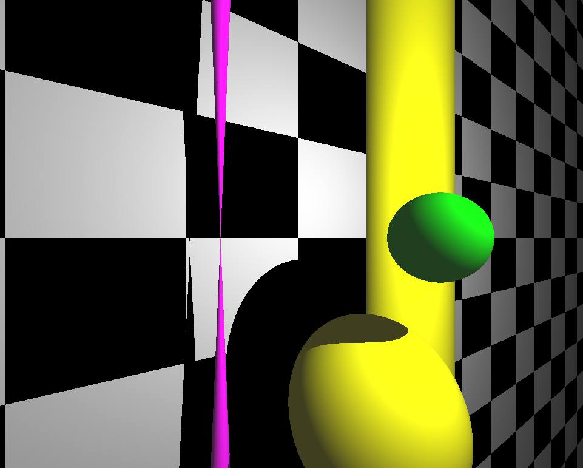
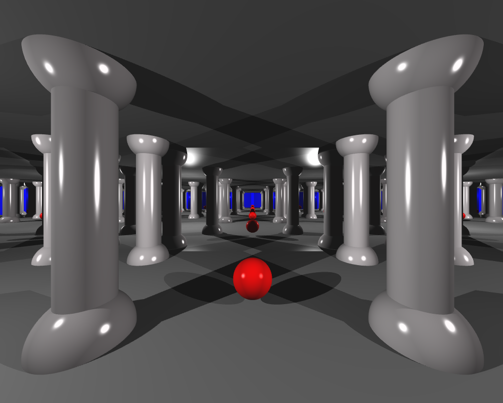
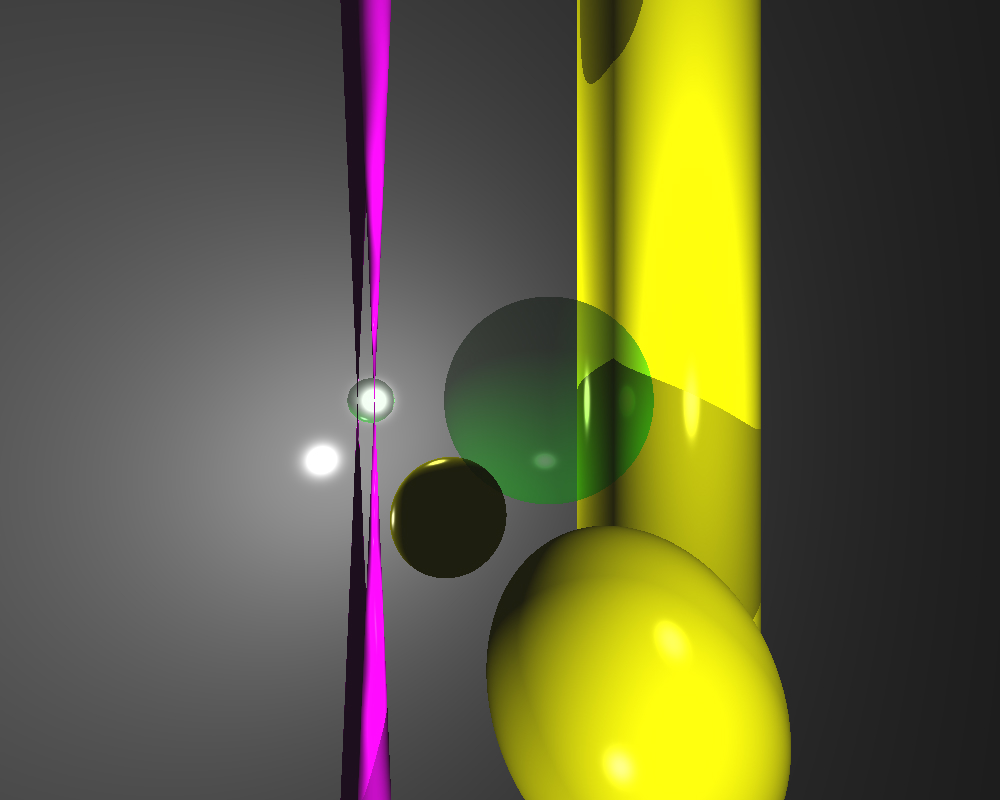
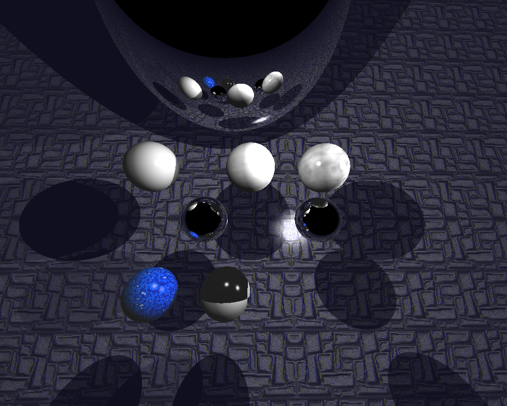

# RT

Réalisation d'images de synthèse grâce à la technique du ray tracing. 
Ces images de synthèse représentent une scène, vue d’une position et d’un angle spécifiques qu'il est possible de modifier, définie par des objets géométriques simples,  et disposant d’un système d’éclairage.
Plusieurs options ont été ajoutées à ce programme :
- Mouvement de la caméra
- Scène modifiable en live (ajout/suppression d'objets, changement de forme, rayon, couleur, déplacement, etc...)
- Fichier de description de scène en .xml
- Possibilité de prendre un screenshot en .jpg
- Possibilité de sauvegarder la scène après modification dans un nouveau .xml
- Gestion des erreurs (parsing, modification des scènes, etc...)
- Message d'attente de chargement
- Multi-threading
- Multi-sampling / Anti-aliasing
- Flou gaussien
- Plusieurs effets de scène (sépia, noir et blanc, brouillard, cel shading, ...)
- Lumière ambiente et parallèle
- Réflexion
- Transparence
- Textures, bruit de perlin
- Perturbation de la limite

